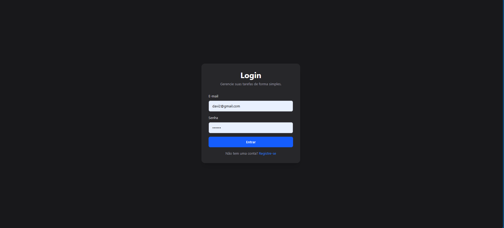
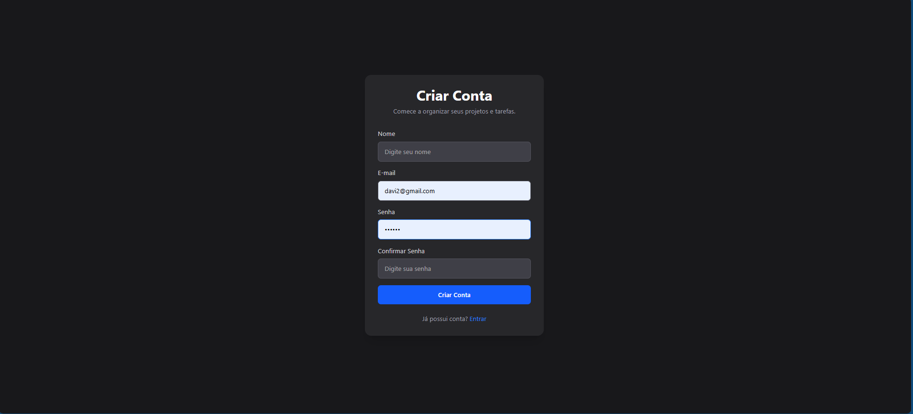
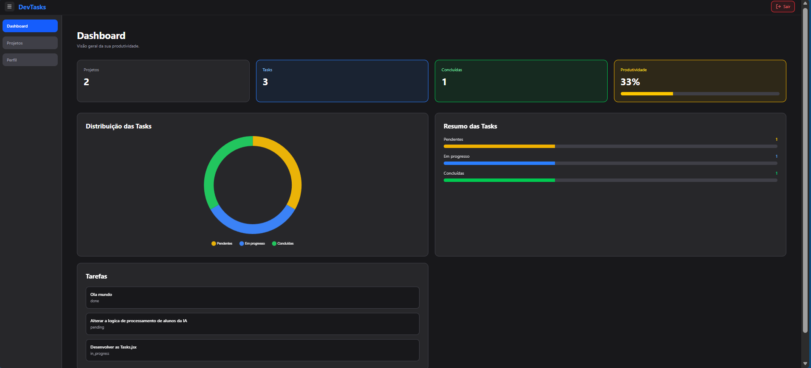
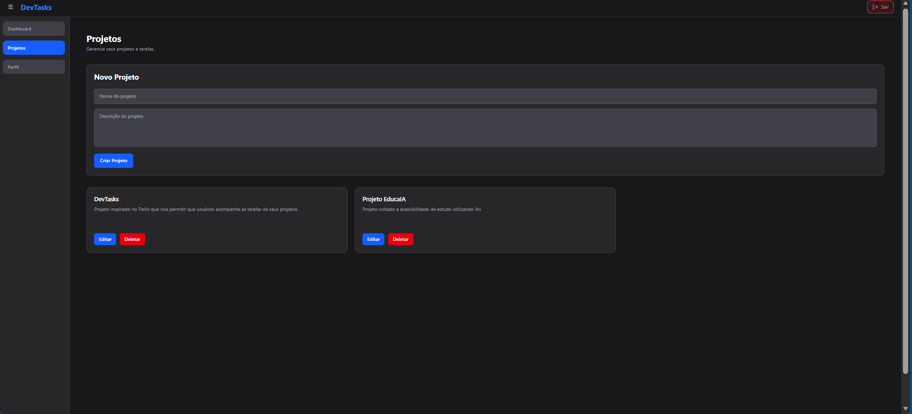
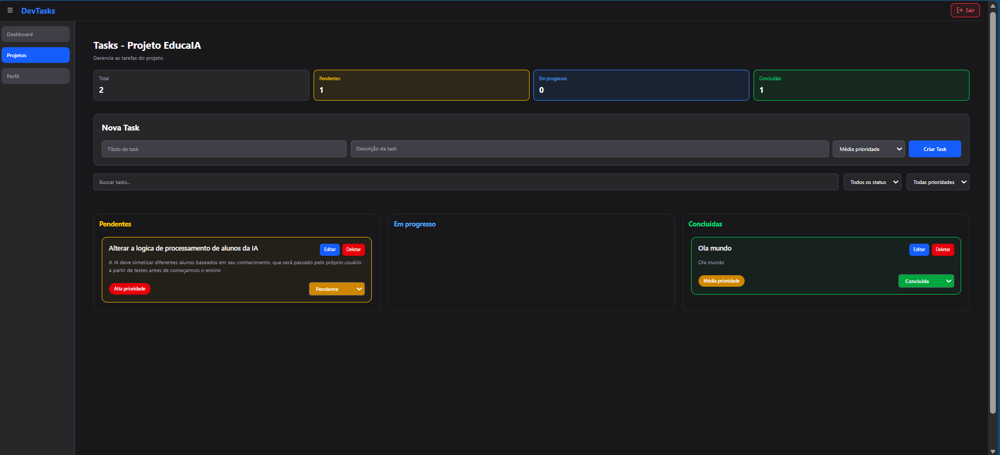
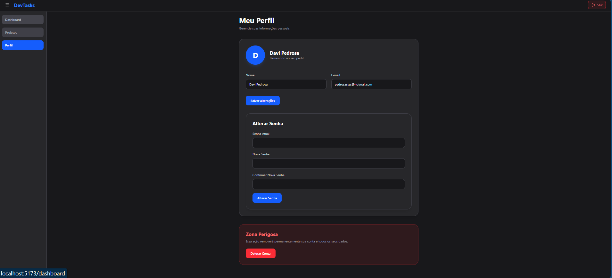

# DevTasks API 🚀

Plataforma Full Stack para gerenciamento de tarefas e projetos, desenvolvida com arquitetura moderna utilizando Node.js, Express, Prisma ORM, React e MySQL.

O projeto foi criado com foco em boas práticas de desenvolvimento backend/frontend, autenticação JWT, componentização, responsividade, testes automatizados e ambiente totalmente containerizado com Docker.

---

## ✨ Funcionalidades

- Cadastro e autenticação de usuários
- Criação e gerenciamento de projetos
- Criação, edição e remoção de tarefas
- Controle de status das tasks
- Estatísticas de tarefas por projeto
- Validação de dados
- Tratamento centralizado de erros
- Testes automatizados com Jest e Supertest
- Banco de dados MySQL com Prisma ORM
- Ambiente dockerizado com Docker Compose
- Dashboard com gráficos
- Drag and Drop no Kanban
- Sidebar retrátil
- Topbar global
- Perfil de usuário
- Alteração segura de senha
- Exclusão de conta
- Expiração de token JWT
- Logout automático
- Interface responsiva

---

## 🛠️ Tecnologias utilizadas

- Node.js
- Express
- Prisma ORM
- MySQL
- JWT
- Jest
- Supertest
- Docker
- Docker Compose
- React
- React Router DOM
- TailwindCSS
- Axios
- Recharts

---

## 📁 Estrutura do projeto

```bash
DevTasks/
├── backend/
│   ├── prisma/
│   ├── src/
│   │   ├── controllers/
│   │   ├── services/
│   │   ├── routes/
│   │   ├── middlewares/
│   │   ├── validations/
│   │   ├── utils/
│   │   └── tests/
│   │
│   ├── Dockerfile
│   └── docker-compose.yml
│
├── frontend/
│   ├── public/
│   ├── src/
│   │   ├── assets/
│   │   ├── components/
│   │   ├── contexts/
│   │   ├── pages/
│   │   ├── routes/
│   │   ├── services/
│   │   └── styles/
│   │
│   ├── vite.config.js
│   └── package.json
```

---

## 📚 Documentação Swagger

A documentação da API pode ser acessada em:

```bash
http://localhost:3000/api-docs
```

---

## ⚙️ Como executar o projeto

### Pré-requisitos

- Docker
- Docker Compose

---

### Clonar o repositório

```bash
git clone <URL_DO_REPOSITORIO>
```

---

### Acessar a pasta backend

```bash
cd backend
```

---

### Subir aplicação

```bash
docker compose up --build
```

### Em outro terminal, acesse o frontend

```bash
cd frontend
```

### Rode o comando

```bash
npm run dev
```

Agora a API estará disponível em:

```bash
http://localhost:5173
```

Pronta para ser utilizada...

---

## 🗄️ Banco de dados

O projeto utiliza MySQL em container Docker.

As migrations do Prisma são executadas automaticamente ao iniciar a aplicação.

---

## 🧪 Testes automatizados

O projeto possui testes automatizados utilizando Jest e Supertest cobrindo:

- autenticação
- usuários
- projetos
- tarefas
- permissões
- validações
- regras de negócio

Executar testes:

```bash
docker exec -it taskify-api npm test
```

---

## 🔐 Autenticação

A autenticação é feita utilizando JWT Bearer Token.

Rotas protegidas exigem:

```bash
Authorization: Bearer TOKEN
```

---

## 📌 Endpoints principais

### Usuários

- POST `/users/register`
- POST `/users/login`
- GET `/users/me`
- PATCH `/users/me`
- PATCH `/users/me/password`
- DELETE `/users/me`

### Projetos

- GET `/projects`
- POST `/projects`
- PUT `/projects/:id`
- DELETE `/projects/:id`

### Tasks

- GET `/tasks`
- POST `/tasks`
- PUT `/tasks/:id`
- PATCH `/tasks/:id/status`
- GET `/tasks/stats`

---

## 🚀 Melhorias futuras

- Upload de avatar
- Refresh Token
- Notificações
- Tema Dark/Light
- Deploy em cloud
- CI/CD
- Recuperação de senha via email

---

## 📸 Imagens do Projeto

### Login

<p align="center">
  
</p>

---

### Registro

<p align="center">
  
</p>

---

### Dashboard

<p align="center">
  
</p>

---

### Projetos

<p align="center">
  
</p>

---

### Tasks

<p align="center">
  
</p>

---

### Perfil

<p align="center">
  
</p>

## 👨‍💻 Autor

Desenvolvido por Davi Pedrosa.
